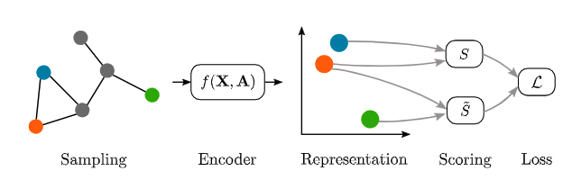

# Unsupervised Graph Representation Learning
In this project, we conducted a survey on unsupervised graph representation learning and implemented them to deal with two downstream tasks, node classification and link prediction. To run these methods, you can first install all dependencies and follow instructions in each method folder.

## Install dependencies

```
pip install -r requirements.txt
```

## Selected Methods
Here we provide a full list of selected methods and you can click on any one to check its details and how to run the algorithm.

- [DeepWalk](https://github.com/phanein/deepwalk)

- [node2vec](./Node2Vector)

- [GraphSAGE](./SAGE)

- [ARGA & ARVGA](./ARGA)

- [DGI](./DGI)

- [GMI](./GMI)

- [GCN + SS](./SS-GCNs)

## A General Framework


  

